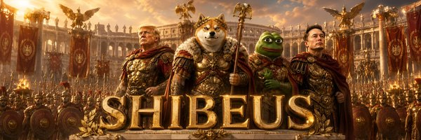

# 🏛️ Shibeus Maximus — Emperor of Memecoins

> *Veni. Vidi. HODL.*

The official meme website for **Shibeus Maximus** — an imperial, Roman-themed
landing page for the immortal meme empire.



## ✨ Features

- **Cinematic hero** with floating animated coin, glowing ring, and legion banner.
- **The Empire** — story section with trust badges.
- **Tokenomics** — supply, tax, liquidity, and contract cards.
- **How to Buy** — four-step guide + one-click copy contract address.
- **Conquest roadmap** — four-phase imperial campaign timeline.
- **Chronicles gallery** — 12 epic scenes with a full-screen lightbox
  (keyboard + arrow navigation).
- **⚒️ Meme Forge** — an in-browser meme generator: pick a Shibeus scene,
  add top/bottom war cries, stamp your **X handle**, and download a ready-to-post
  1200×675 X-post image — plus a one-click "Share to X" button.
- **⚽ Shibeus FC** (`fc.html`) — a degen **penalty-kick betting game** modeled on
  degenfc.fun. **Connect Phantom** (real, read-only), then each round:
  - **GOAL or MISS** main bet, paying **×1.98**.
  - Optional **ZONE bet** — call the exact corner on a GOAL pick for up to **×9.90**
    (a separate stake riding on the same shot).
  - **Provably-fair** engine: every outcome is committed as
    `HMAC-SHA256(serverSeed, clientSeed:nonce)` before reveal, with a per-shot
    **proof** view and **rotate-and-reveal** seed verification.
  - **Account** modal (custodial-style): Profile (display handle, balance, log out),
    Deposit (address/QR + demo-credit grant), Withdraw — deposits/withdrawals are
    clearly gated to launch so no real SOL can be sent in BETA.
  - **Leaderboard** (Profit / Wagered), live **GOAL/MISS sentiment** bar, animated
    CSS/SVG stadium with a 5-zone target grid, session stats, shot-history feed,
    and a first-run onboarding carousel.
  Runs on free **arena credits** in BETA; on-chain SOL deposits/withdrawals/payouts
  activate server-side at launch (see `SETUP.md`).
- Fully **responsive**, with reduced-motion support and SEO/Open-Graph tags.

## 🚀 Run it

It's a static site — no build step. Just open `index.html`, or serve locally:

```bash
python3 -m http.server 8000
# then visit http://localhost:8000
```

> The meme generator uses the HTML Canvas API and reads local images, so it must
> be served over `http://` (not opened as a `file://` URL) for downloads to work
> in all browsers.

## 📁 Structure

```
.
├── index.html        # markup
├── arena.html        # holder gate · trivia-to-earn · raffle
├── fc.html           # Shibeus FC — penalty betting game
├── styles.css        # imperial gold + emerald theme
├── fc.css            # Shibeus FC stadium + betting console
├── script.js         # nav, reveals, lightbox, meme generator
├── game.js           # arena logic
├── fc.js             # Shibeus FC: Phantom connect, odds, provably-fair
├── api/              # serverless: verify-holder, claim, raffle
└── assets/
    ├── shibeus.png   # the coin / logo
    ├── banner.jpg    # legion hero banner
    └── gallery/      # the Chronicles artwork
```

## 🎨 Theme

Deep imperial black, **gold** (`#e8c069`) leaf, and **emerald** (`#5fe06a`)
energy accents drawn straight from the artwork. Display type is *Cinzel*; body
copy is *Inter*.

---

*$SHIBEUS is a meme coin for entertainment purposes only. Not financial advice. DYOR.*
